# Slowpoke Training Bot

Бот для замеров и рекордов

## Команды

1. [Замеры](#measure)
    - [Список последних замеров](#measure-last-list)
    - [Список замеров](#measure-list)
    - [Добавить замер](#measure-add)
    - [Изменить замер](#measure-update)
    - [Удалить замер](#measure-delete)
2. [Рекорды](#record)
    - [Список последних рекордов](#record-last-list)
    - [Список рекордов](#record-list)
    - [Добавить рекорд](#record-add)
    - [Изменить рекорд](#record-update)
    - [Удалить рекорд](#record-delete)
3. [Настройки](#settings)
    - [Уведомления](#settings-notification)
    - [Замеры](#settings-measure)
4.  [Экспорт данных](#export)
5. [О боте](#info)

## Замеры 
Команда позволяет добавлять, изменять и обновлять замеры тела.

### Список последних замеров 
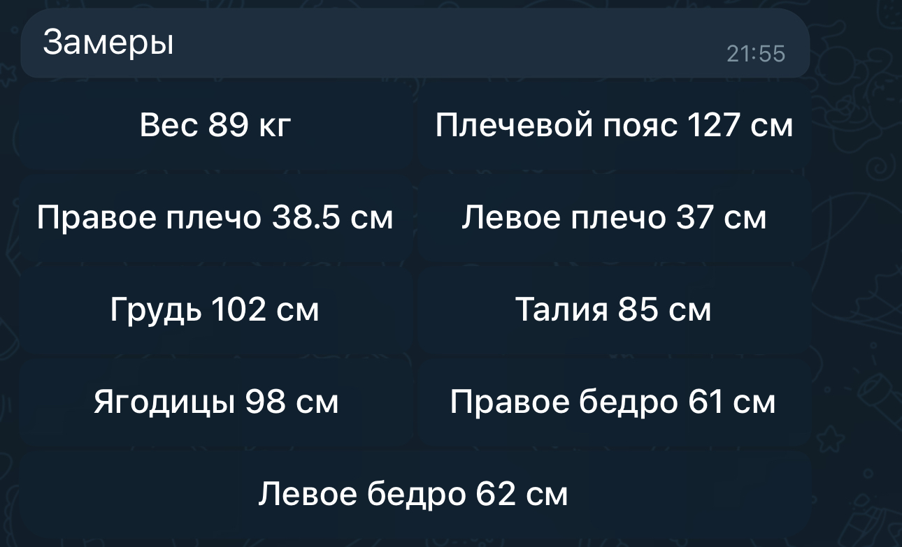

Чтобы посмотреть список последних замеров, выберите команду *Замеры* в меню или введите `/measure`.

> Показываются только те замеры, которые выбраны в настройках

### Список замеров 
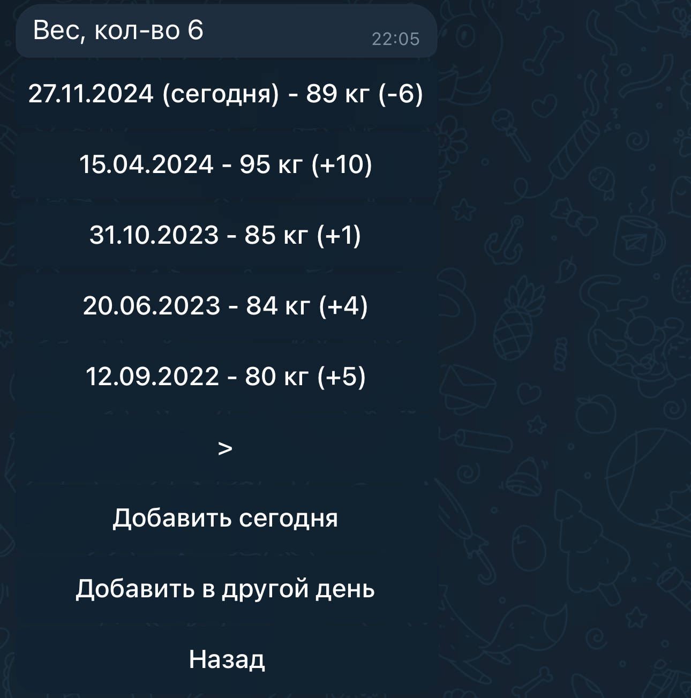

Выберите один замер, например *Вес*, чтобы увидеть историю значений замера. В сообщении указано общее количество значений замеров.

> На каждой странице по 5 записей

### Добавить замер 
Добавить значение замера можно несколькими способами:
- [Добавить сегодня](#measure-add-today)
- [Быстрое добавление](#measure-add-fast)
- [Добавить в другой день](#measure-add-calendar)

> Если значение замера уже есть на эту дату, то его значение будет обновлено

#### Добавить сегодня 
1. Выберите замер из списка замеров
2. Нажмите кнопку *Добавить сегодня*
3. Введите числовое значение
4. Значение замера будет добавлено в список сегодняшним днем

#### Быстрое добавление 
1. Выберите замер из списка замеров
2. Введите числовое значение
3. Значение замера будет добавлено в список сегодняшним днем

#### Добавить в другой день 
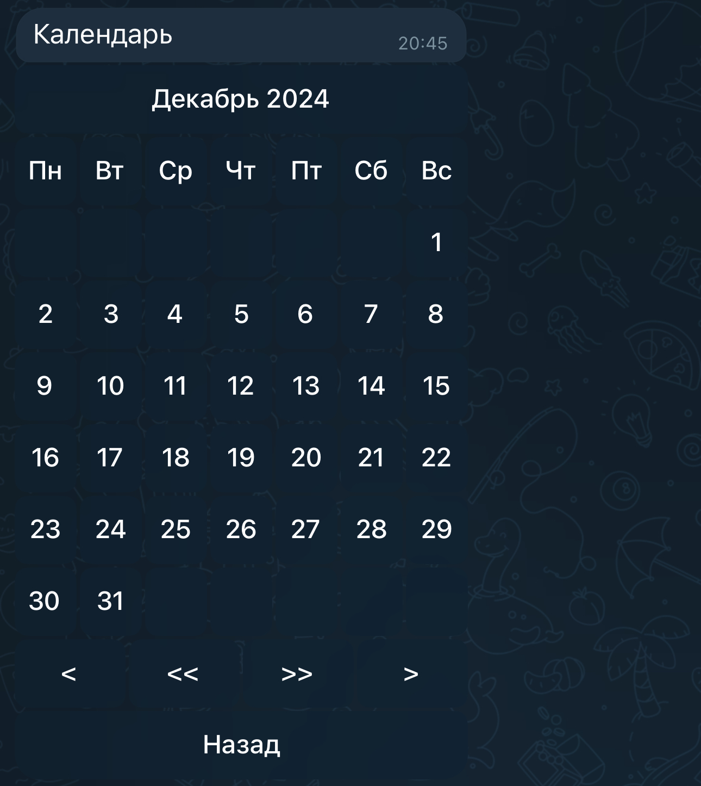

1. Выберите замер из списка замеров
2. Нажмите кнопку *Добавить в другой день*
3. Выберите день в календаре
4. Введите числовое значение
5. Значение замера будет добавлено в список

### Изменить замер 
Изменить значение замера можно несколькими способами:
- [Изменить значение](#measure-update-base)
- [Быстрое изменение](#measure-update-fast)

#### Изменить значение 
1. Выберите замер из списка замеров
2. Выберите значение замера, которое хотите изменить
3. Нажмите кнопку *Изменить*
4. Введите числовое значение
5. Значение замера изменится

#### Быстрое изменение 
1. Выберите замер из списка замеров
2. Выберите значение замера, которое хотите изменить
3. Введите числовое значение
4. Значение замера изменится

### Удалить замер 
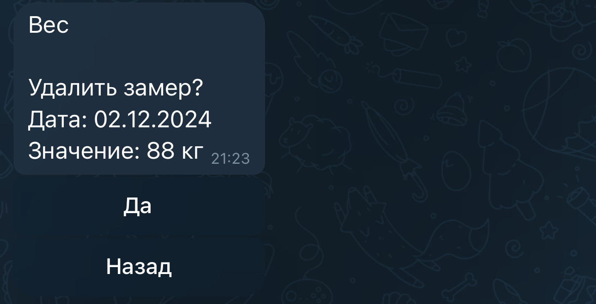

1. Выберите замер из списка замеров
2. Выберите значение замера, которое хотите удалить
3. Нажмите кнопку *Удалить*
4. Подтвердите удаление замера
5. Значение замера удалится

## Рекорды 

Команда позволяет добавлять, изменять и обновлять рекорды.

### Список последних рекордов 
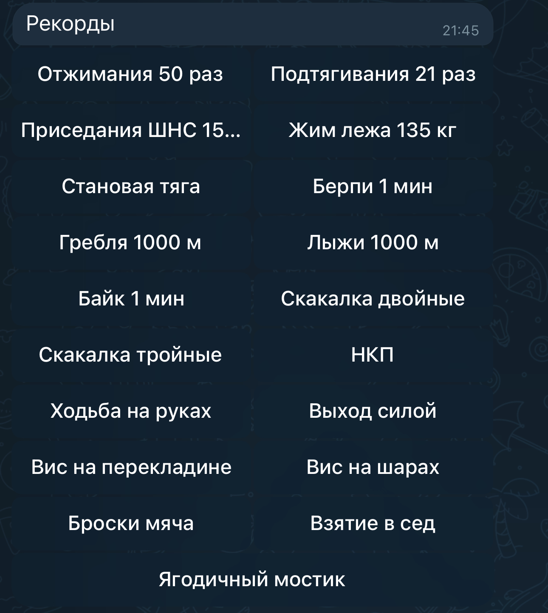

Чтобы посмотреть список последних рекордов, выберите команду *Рекорды* в меню или введите `/record`.

> Показываются все доступные рекорды

### Список значений рекордов 
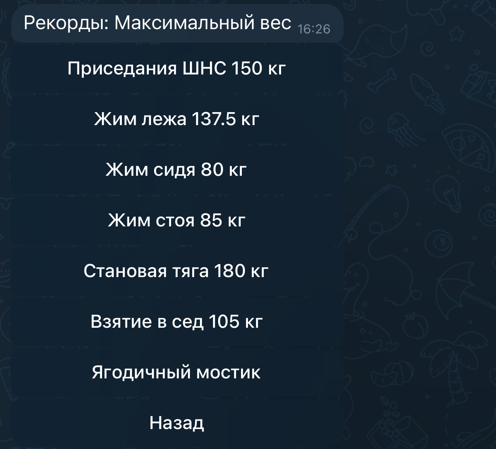

Выберите один рекорд, например *Отжимания*, чтобы увидеть историю значений рекорда. В сообщении указано общее количество значений рекорда.

> На каждой странице по 5 записей

### Добавить рекорд 
Добавить значение рекорда можно несколькими способами:
- [Добавить сегодня](#record-add-today)
- [Быстрое добавление](#record-add-fast)
- [Добавить в другой день](#record-add-calendar)

> Если рекорд уже есть на эту дату, то его значение будет обновлено

#### Добавить сегодня 
1. Выберите рекорд из списка рекордов
2. Нажмите кнопку *Добавить сегодня*
3. Введите числовое значение
4. Значение рекорда будет добавлено в список сегодняшним днем

#### Быстрое добавление 
1. Выберите рекорд из списка рекордов
2. Введите числовое значение
3. Значение рекорда будет добавлено в список сегодняшним днем

#### Добавить в другой день 

1. Выберите рекорд из списка рекордов
2. Нажмите кнопку *Добавить в другой день*
3. Выберите день в календаре
4. Введите числовое значение
5. Значение рекорда добавиться в список

### Изменить рекорд 
Изменить значение рекорда можно несколькими способами:
- [Изменить значение](#record-update-base)
- [Быстрое изменение](#record-update-fast)

#### Изменить значение  
1. Выберите рекорд из списка рекордов
2. Выберите значение рекорда, которое хотите изменить
3. Нажмите кнопку *Изменить*
4. Введите числовое значение
5. Значение рекорда изменится

#### Быстрое изменение  
1. Выберите рекорд из списка рекордов
2. Выберите значение рекорда, которое хотите изменить
3. Введите числовое значение
4. Значение рекорда изменится

### Удалить рекорд 
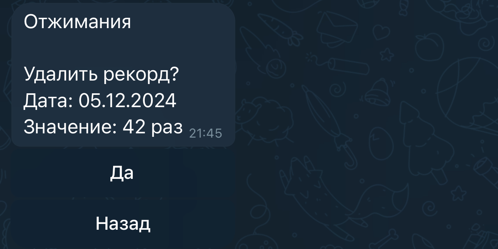

1. Выберите рекорд из списка рекордов
2. Выберите значение рекорда, которое хотите удалить
3. Нажмите кнопку *Удалить*
4. Подтвердите удаление рекорда
5. Значение рекорда удалиться

## Настройки 

Команда *Настройки* в меню или введите `/settings`

Доступны настройки:
- [Настройки: уведомления](#settings-notification)
- [Настройки: замеры](#settings-measure)

### Настройки: уведомления 
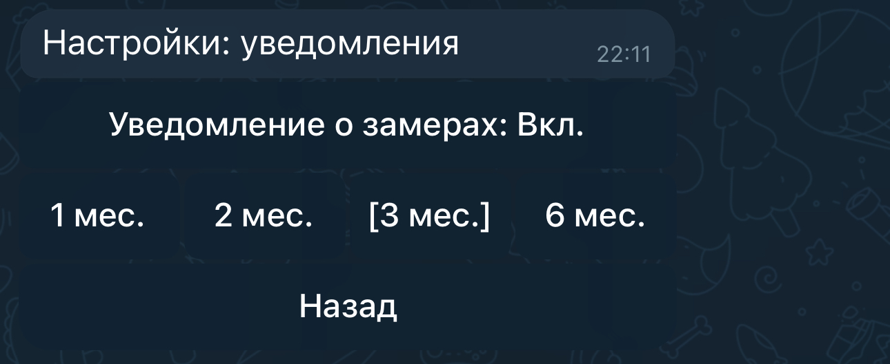

Можно выбрать периодичность уведомления о замерах или отключить уведомление о замерах

### Настройки: замеры 
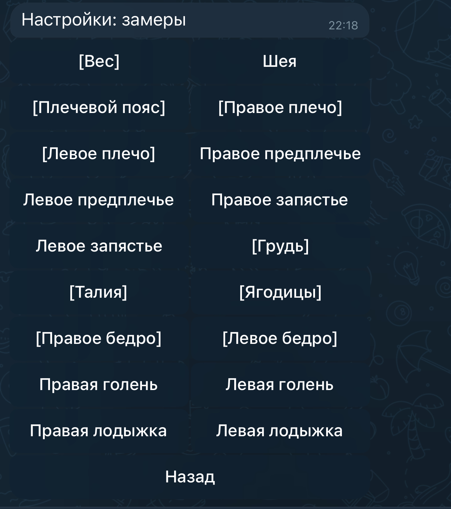

Можно выбрать нужные замеры

> Выбранные замеры в квадратных скобочках

### Экспорт данных 

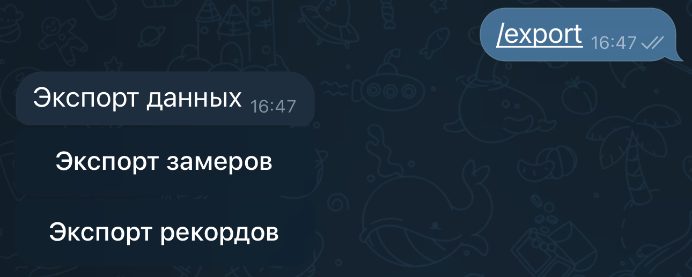

Команда *Экспорт данных* в меню или введите `/export`
Можно экспортировать замеры, рекорды за все время или за год

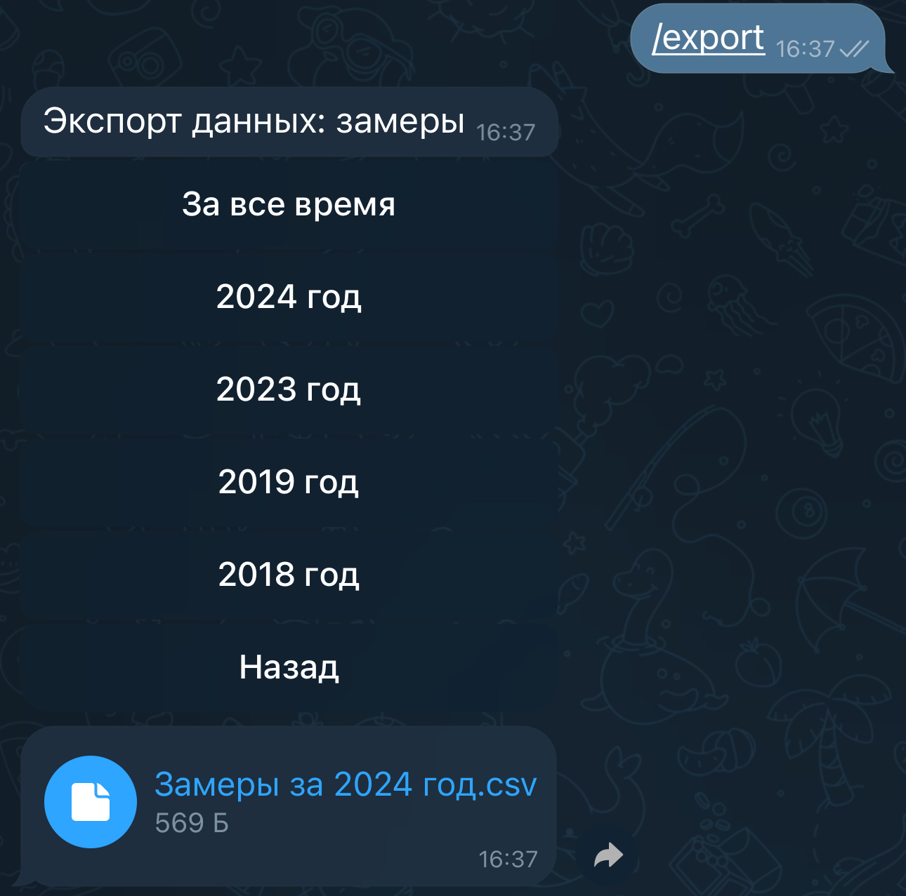

В ответ вы получите файл с расширением  `csv`

## О боте 
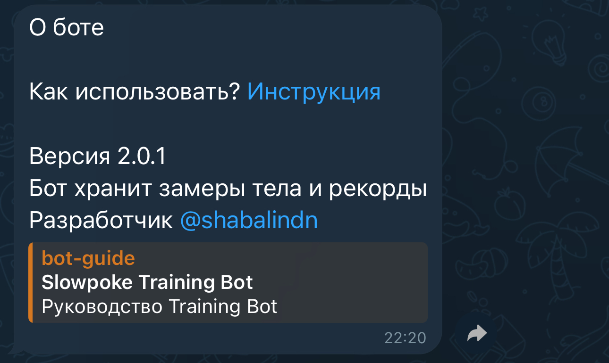

Содержит ссылку на эту инструкцию, версию и описание бота, ссылку на разработчика
