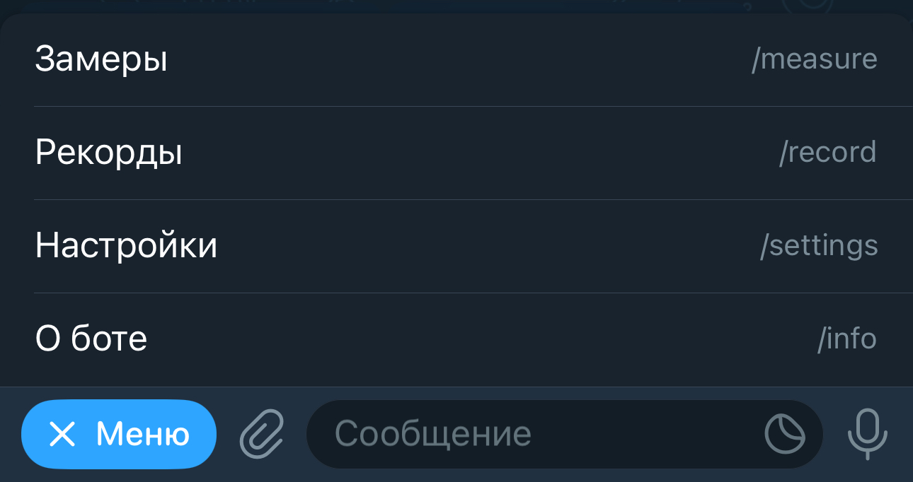

# Slowpoke Training Bot

Инструкция Slowpoke Training Bot

## Команды

1. [Замеры](#measure)
    1. [Список последних замеров](#measure-last-list)
    2. [Список замеров](#measure-list)
    3. [Добавить сегодня](#measure-add-today)
    4. [Добавить в другой день](#measure-add-calendar)
    5. [Быстрое добавление](#measure-add-fast)
    6. [Изменить](#measure-update)
    7. [Быстрое изменение](#measure-update)
    8. [Удалить](#measure-delete)
2. [Рекорды](#record)
    1. [Список последних рекордов](#record-last-list)
    2. [Список рекордов](#record-list)
    3. [Добавить сегодня](#record-add-today)
    4. [Добавить в другой день](#record-add-calendar)
    5. [Быстрое добавление](#record-add-fast)
    6. [Изменить](#record-update)
    7. [Быстрое изменение](#record-update)
    8. [Удалить](#record-delete)
3. [Настройки](#settings)
    1. [Уведомления](#settings-notification)
    1. [Замеры](#settings-measure)
4. [О боте](#info)

## Замеры 

Команда позовляет добавлять, изменять и обновлять замеры тела.

### Список последних замеров

## Рекорды 

Команда позволяет добавлять, изменять и обновлять рекорды.

## Настройки 

Настройки бота, такие как уведомление о замерах и выбранные замеры.

## О боте 

Содержит ссылку на эту инструкцию, описание бота и ссылку на разработчика
